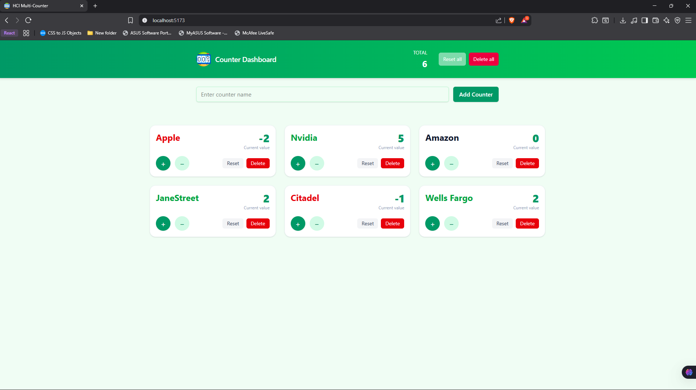

# CounterLab — Multi Counter Dashboard



*A small React + Vite app that lets you create multiple counters, increment/decrement them, reset, and delete. The UI is styled with Tailwind CSS and counter data is persisted to localStorage (and synced across tabs).*

## Features

- Create named counters
- Increment / decrement values with quick buttons
- Reset or delete individual counters
- Persistent storage using localStorage (survives page refresh)
- Cross-tab sync (changes in one tab update others)
- Responsive layout built with Tailwind CSS

## Quick start

Requirements:
- Node.js 18+ (or a recent LTS)
- npm (or your preferred package manager)

Install dependencies and run the dev server:

```powershell
npm install
npm run dev
```

Open http://localhost:5173 (or the port Vite shows) to view the app.

Build for production:

```powershell
npm run build
npm run preview
```

## Project structure (important files)

- `src/App.jsx` — App root. Handles state, persistence (localStorage), and high-level layout.
- `src/index.css` — imports Tailwind base. Tailwind utilities are available throughout the app.
- `src/components/Header.jsx` — top header with total sum display.
- `src/components/AddCounterForm.jsx` — form to add counters.
- `src/components/CounterList.jsx` — grid container for counter cards.
- `src/components/CounterCard.jsx` — individual counter card with controls.

## Persistence details

Counters are stored under the key `multi-counter:counters` in `localStorage`. The app:

- Loads saved counters on startup (falls back to an empty list if storage is missing or malformed).
- Saves counters whenever they change.
- Listens for `storage` events to update state when another tab modifies the stored counters.

This is intentionally simple and suited for small datasets. If you need to store large datasets or require robust offline support, consider using IndexedDB (e.g. with localForage).

## Tailwind

Tailwind is already installed and `src/index.css` imports Tailwind. If you need to update Tailwind settings (colors, breakpoints, plugins), edit or add a `tailwind.config.cjs` in the project root.

## Next steps / ideas

- Add an empty-state screen when there are no counters
- Add "Reset all" / "Export JSON" / "Import JSON" features
- Add small animations to card interactions
- Add tests for core behaviors (adding counters, increment/decrement, persistence)

If you'd like, I can implement any of the items above. Tell me which one to work on next.
